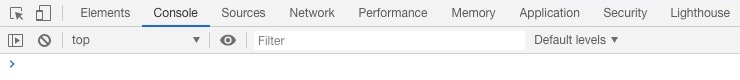

# Satisfied Lieutenant
Customize Discord with your favourite wallpaper and spice up _your place to talk_ with a minimalistic material design!

Example 1 | Example 2 | Example 3 (Light mode)
-|-|-
 |  | 

## Usage
```bash
git clone https://github.com/ChingChang9/satisfied-lieutenant.git
cd satisfied-lieutenant

# To get the mirio wallpaper
node . mirio
```
This will generate the code to style up your Discord in your clipboard so you can paste it in Discord's console right away. You can also find this code in `background` so you don't need to run this every time to get the code :D

Now you need to paste the code in Discord's console, which can be opened by pressing `cmd` + `opt` + `I` on Mac or `ctrl` + `shift` + `C` on Windows. You should see something similar to this:


You might also see this warning:


So get your resume ready for Discord, paste the code, and hit enter. Now you have an awesome theme to share with your friends! (Or Wumpus, if you don't have friends)

## How to use?
Run `index.js` with an additional argument of the image you want. The available image names can be found in `images.json`.

You can add your own images to `images.json` following the following format:
```js
{
  "your-image-name": {
    "url": "your-image-url",
    "shadow": value
  }
}
```
`your-image-name`: The name you will reference when running `index.js`. \
`your-image-url`: The link of your image. Due to Discord's Content Security Policy, only links under certain domains can be used. If you want to use your own image, the easiest way is to upload it to Discord and copy the image link. \
`value`: How much to darken your image on a scale from 0 (no shadow) to 1 (completely black) so the texts are easier to read. Unlike `your-image-name` and `your-image-url`, don't surround this value with `"`s.

## Credits
Inspired by [Ctrl W's Clean Discord](https://userstyles.org/styles/175290/clean-discord). \
I do not own any of the wallpapers in `images.json`. All credits of the images go to the original artists on [Wallpaperflare](https://www.wallpaperflare.com/).